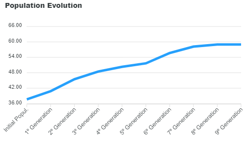

# Simple Genetic Algorithm

A simple genetic algorithm where a population evolves. Access the project page clicking [here](https://jv-amorim.github.io/simple-genetic-algorithm/).

Read more about [genetic algorithms](https://en.wikipedia.org/wiki/Genetic_algorithm).

The main file in this repository is [genetic-algorithm.ts](./genetic-algorithm.ts). All the logic about the genetic algorithm must be read from it.

## How to Execute

The project can be executed by opening the `index.html` file in a modern browser. However, any changes in the TypeScript code must be saved and compiled to JavaScript. The compilation can be made executing `tsc .\genetic-algorithm.ts --module ES2015` in the terminal (you must have Node.js installed and TypeScript globally instaled via NPM). 

## License

This project is licensed by MIT License. Read the [license page](https://opensource.org/licenses/MIT) for more details.
